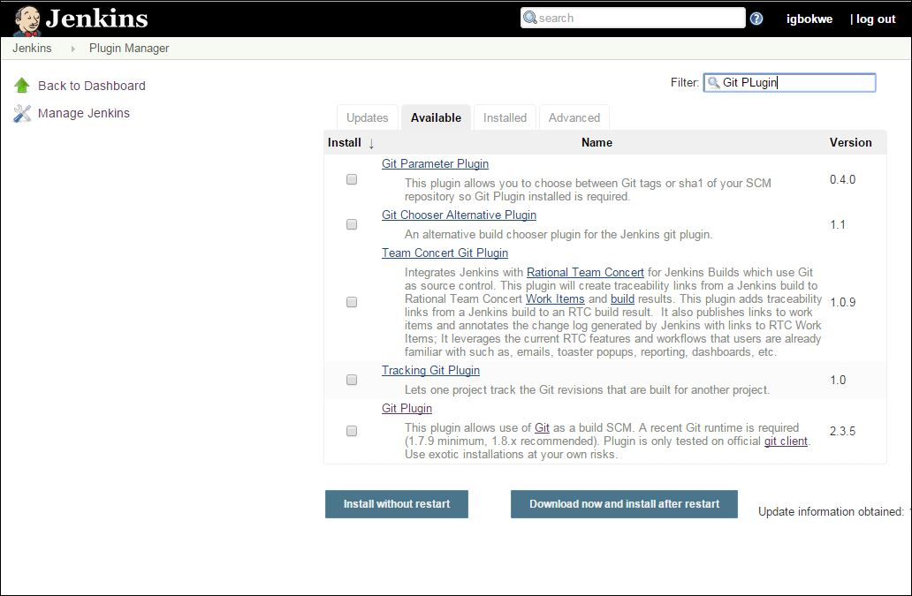
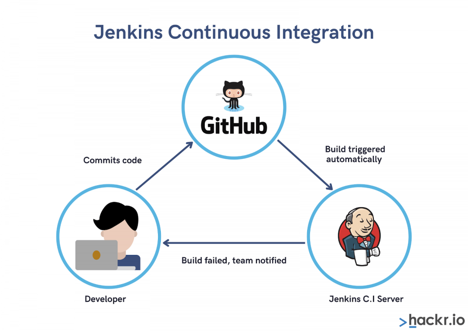
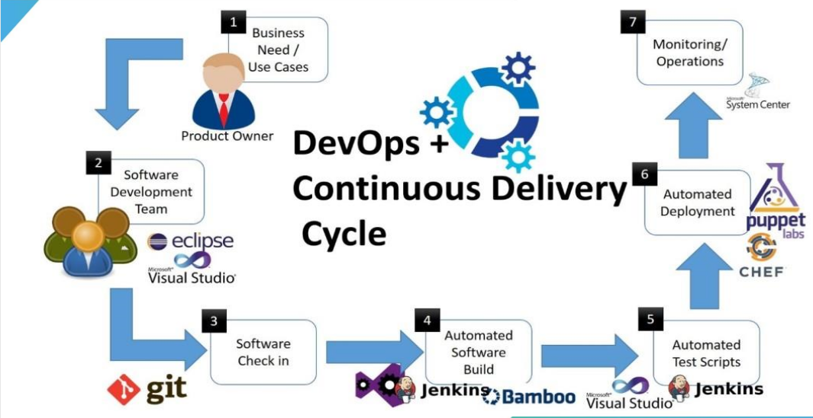

# The Jenkins Experience - Unleash the Memes! 🚀

## Introduction

Welcome to the wild world of Jenkins! 🎉 This README will guide you through the magical land of continuous integration and deployment, all while having a laugh with some memes.

### What is Jenkins?

Jenkins is like your software's personal assistant. It automates the repetitive tasks in your development process, making your life easier and code deployment smoother.


## Getting Started

### 1. **Installation** 🛠️👷

#### 1. **MacOS**

Install the latest LTS version

```bash
  brew install jenkins-lts
```

Start the Jenkins service

```bash
  brew services start jenkins-lts
```

Restart the Jenkins service

```bash
  brew services restart jenkins-lts
```

Update the Jenkins version

```bash
  brew upgrade jenkins-lts
```

#### 2. **Windows**

Download the installer using this [link](https://www.jenkins.io/download/thank-you-downloading-windows-installer-stable)

> :warning: **You need to install Java Jdk first**

Getting Jenkins up and running is as easy as clicking a button... almost. Check out the [official Jenkins installation guide](https://www.jenkins.io/doc/book/installing/) for a smooth setup.

### 2. **First Build**

- Create your first Job/App oon jenkins

- Configure you App settings.

- Install wanted Plugins.

- Configure your build steps.

- Have fun. 🎉


## Advanced Fun

### 3. **Plugins Galore**



Jenkins has a plugin for everything! Want to integrate with your favorite tools? There's a plugin for that. Dive into the [Jenkins Plugin Index](https://plugins.jenkins.io/) and level up your automation game.

### 4. **Pipeline Power**

Jenkins Pipelines - because who doesn't love turning their deployment process into code? Explore the wonders of Jenkins Pipeline syntax [here](https://www.jenkins.io/doc/book/pipeline/syntax/).

## Jenkins in Action

### 5. **Continuous Integration Dance**



Jenkins ensures that your code lives its best life. Every push triggers a build, and Jenkins is there to catch any missteps.

### 6. **Continuous Deployment Celebration**



Deploy with confidence! Jenkins automates your deployment process, making it as smooth as butter on a warm pancake.

## Conclusion


Congratulations! You've survived the Jenkins experience. Embrace automation, laugh at the occasional build hiccup, and enjoy the journey of stress-free deployments. Cheers to Jenkins - the unsung hero of DevOps! 🥂
